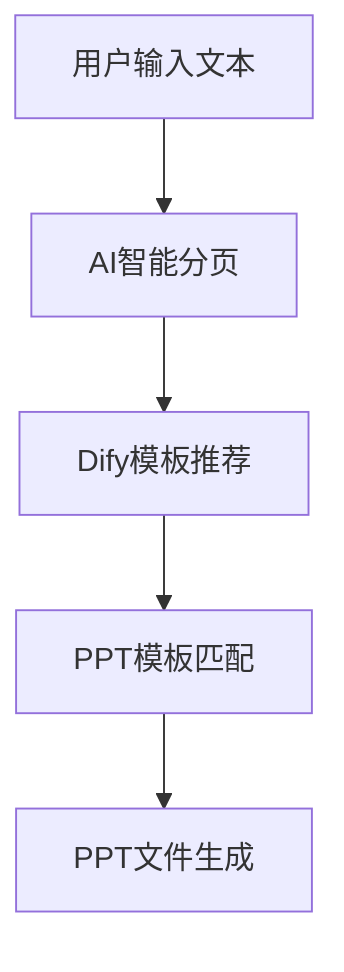

# Dify内容增强功能移除说明

## 📋 修改概述

根据用户需求，已成功移除Dify API的内容增强功能，保留核心的**模板推荐功能**。

## 🔧 主要修改

### 1. **用户界面简化** (`user_app.py`)

**移除的功能：**
- ❌ "启用完整AI处理流程" 复选框
- ❌ Dify API内容增强选项和相关UI
- ❌ 内容增强结果展示
- ❌ API响应详情显示

**保留的功能：**
- ✅ AI智能分页核心功能
- ✅ 分页结果展示
- ✅ 原始文本片段查看

### 2. **Dify API模块简化** (`dify_api_client.py`)

**完全重写为简化版：**
- ❌ 移除`DifyAPIClient`类
- ❌ 移除`DifyIntegrationService`类
- ❌ 移除`APIKeyBalancer`负载均衡器
- ❌ 移除`process_pages_with_dify`函数
- ❌ 移除所有内容处理相关功能

**保留的功能：**
- ✅ `DifyAPIConfig`配置类
- ✅ 基础配置管理
- ✅ 环境变量读取

### 3. **模板桥接功能简化** (`dify_template_bridge.py`)

**简化的修改：**
- ❌ 移除复杂的`APIKeyBalancer`依赖
- ❌ 简化API密钥管理（使用轮询选择）
- ❌ 移除复杂的状态管理和故障转移

**保留的功能：**
- ✅ 模板推荐核心功能
- ✅ Dify API调用（用于获取模板编号）
- ✅ 模板文件匹配
- ✅ 完整的桥接流程

### 4. **集成应用更新** (`integrated_app.py`)

**移除的导入：**
- ❌ `process_pages_with_dify`

**保留的功能：**
- ✅ `DifyAPIConfig`配置导入
- ✅ 模板推荐功能

## 🎯 功能对比

| 功能模块 | 修改前 | 修改后 |
|---------|-------|-------|
| **AI智能分页** | ✅ 完整功能 | ✅ 完整功能 |
| **Dify模板推荐** | ✅ 完整功能 | ✅ 完整功能 |
| **Dify内容增强** | ✅ 复杂的并发处理 | ❌ 已移除 |
| **多API密钥负载均衡** | ✅ 高级负载均衡 | 🔄 简化为轮询选择 |
| **PPT生成** | ✅ 完整功能 | ✅ 完整功能 |

## 🚀 核心工作流程（修改后）

**简化说明：**
1. **AI智能分页**：分析文本结构，智能分割页面
2. **Dify模板推荐**：根据文本特征推荐最适合的PPT模板
3. **PPT模板匹配**：找到对应的模板文件
4. **PPT文件生成**：填充内容生成最终PPT

## ✅ 验证结果

**导入测试：**
- ✅ `dify_api_client` 模块导入正常
- ✅ `dify_template_bridge` 模块导入正常  
- ✅ `ai_page_splitter` 模块导入正常

**功能测试：**
- ✅ 无linter错误
- ✅ 所有模块依赖关系正确
- ✅ 核心功能完整保留

## 📝 使用说明

### 保留的核心功能：

1. **AI智能分页**
   - 自动分析文本结构
   - 智能分割为多个页面
   - 生成结构化页面数据

2. **Dify模板推荐**
   - 分析文本特征和主题
   - 推荐最适合的PPT模板编号
   - 自动匹配模板文件

3. **PPT生成**
   - 使用推荐的模板
   - 填充分页后的内容
   - 生成完整的PPT文件

### 移除的功能：

1. **内容增强处理**
   - 页面内容的语言优化
   - 格式标准化处理
   - 批量内容增强

2. **复杂的API管理**
   - 多密钥负载均衡
   - 智能故障转移
   - 并发请求控制

## 🎉 总结

成功移除了Dify内容增强功能，项目变得更加简洁和专注：

- **保留核心价值**：AI智能分页 + 模板推荐
- **简化复杂度**：移除不必要的内容处理层
- **提升可维护性**：减少代码复杂度和依赖关系
- **专注主要功能**：智能模板推荐才是Dify API的核心价值

项目现在回归到最初的设计理念：**智能文本分页** + **智能模板推荐** = **高效PPT生成**。
